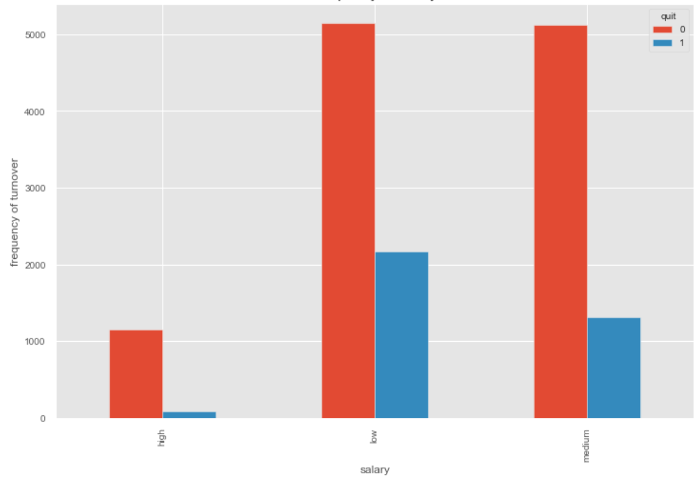
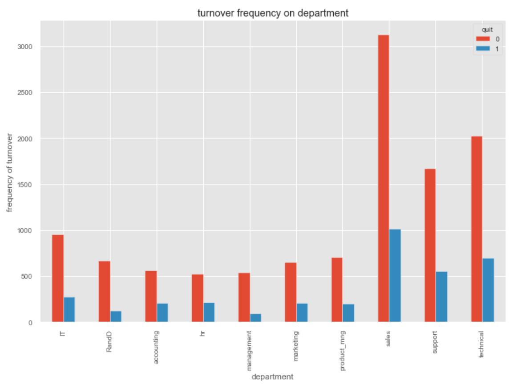
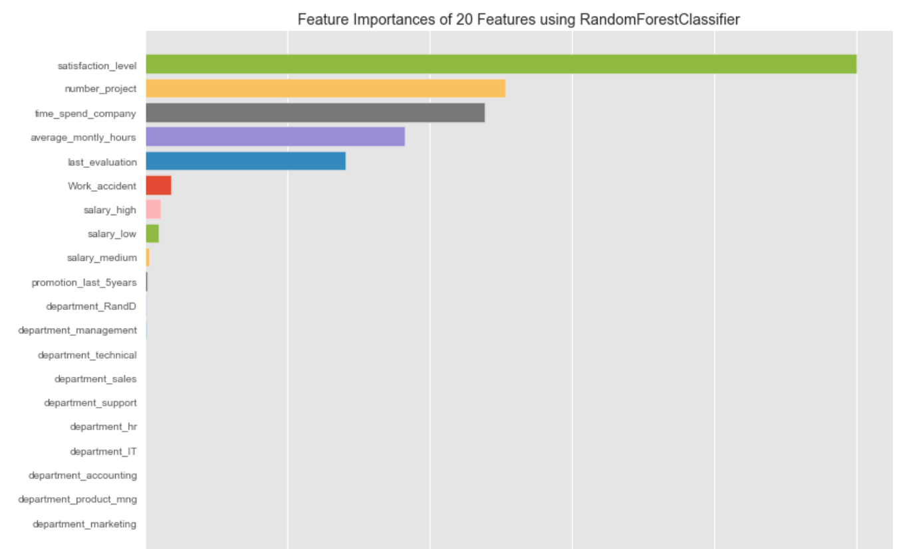
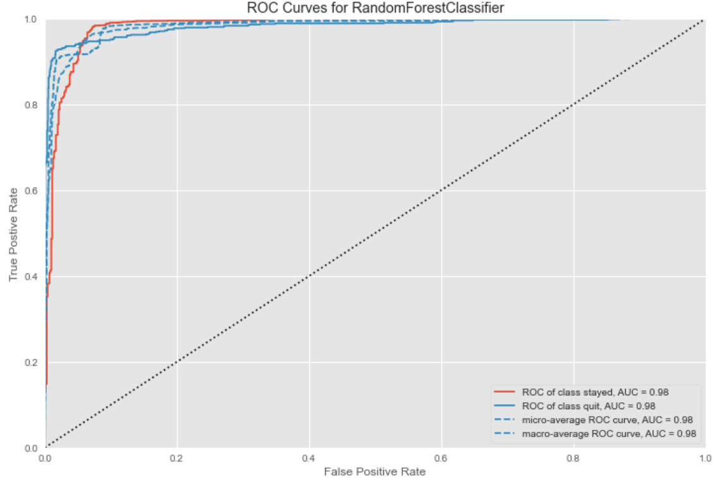
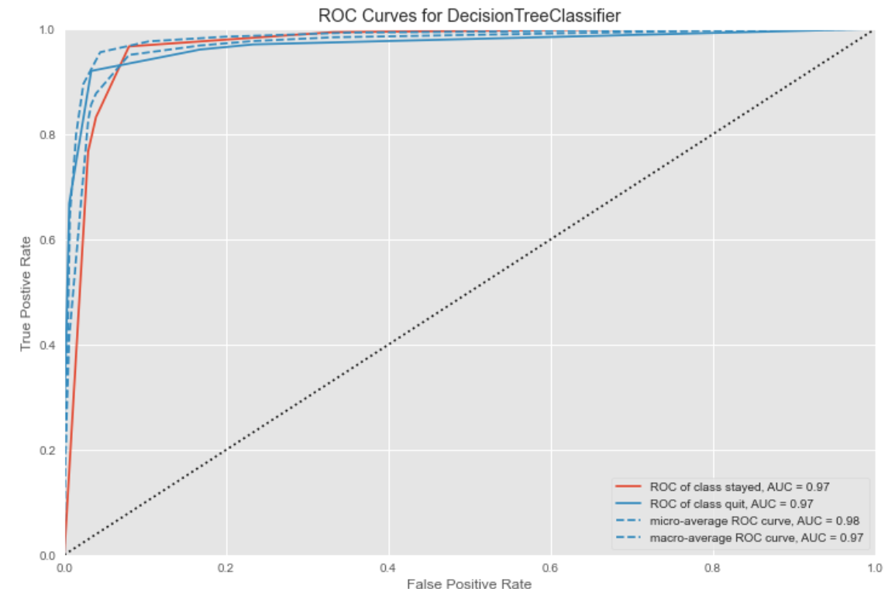

Employee turnover, or employee turnover rate, is the measurement of the number of employees who leave an organization during a specified time period, typically one year.  
  The dataset has the following input features:    
* satisfaction_level  
* last_evaluation  
* number_project - number of projects on which employee has worked 
* average_montly_hours - hours spent by employee on an average in a month  
* time_spend_company -  time from which employee has been a part of the company 
* Work_accident - the number of accidents employee had 
* promotion_last_5years -  umber of promotions empoyee had in last 5 years 
* department - It can be either one of Sales, IT, accounting, HR, marketing, technical, management, support, product_mng, RandD  	
* salary - takes values low/medium/high  
The output feature "Quit" takes label 0 or 1  
* 0 - employee quits  
* 1 - employee stays  
It has 15000 instances  
## Turnover frequency vs salary  
  
Employees with higher wages are less likely to quit as compared to their low and medium salary co-workers. Employees with lower salary are the most likely to quit.  

## Turnover frequency vs department  
  
Employees from sales department, technical department and support department are the most likely to quit so the company's management should pay special attention to these department so that they do not quit like maybe providing them some additional benefits or bonus.  

## Feature Importance  
  
Satisfcation level plays a major role in determining whether or not a employee quits or not so the comapny's management should focus on increasing the average satisfaction level of employees.
Apart from that, number of projects, time spent in company, average monthly hours, last evaluation also play a major role in determining the employee turnover.  
## ROC curve for random forest classifier  
  
## ROC curve for decision tree classifier  
  

